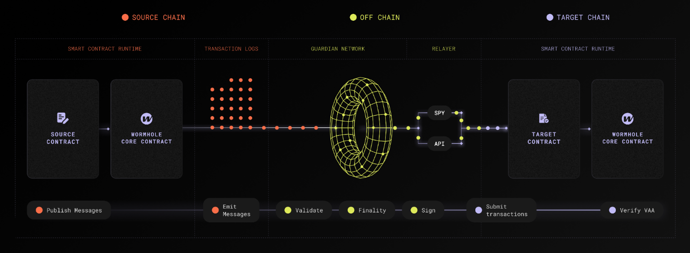

This monorepo contains the reference implementation of the [Wormhole protocol](https://wormholenetwork.com).

To learn about how to use and build on Wormhole read the [docs](https://docs.wormhole.com/).

----

See [Live Contracts](https://wormhole.com/docs/products/reference/contract-addresses/) for current testnet and mainnet deployments of
the Wormhole smart contracts.

See [DEVELOP.md](DEVELOP.md) for instructions on how to set up a local devnet, [CONTRIBUTING.md](CONTRIBUTING.md) for instructions on how to contribute to this project, and [SECURITY.md](SECURITY.md) for more information about our security audits and bug bounty program.

See [docs/operations.md](docs/operations.md) for node operator instructions.

⚠ **This software is distributed on an "AS IS" BASIS, WITHOUT WARRANTIES OR CONDITIONS OF ANY KIND, either express or
implied. See the License for the specific language governing permissions and limitations under the License.** 

Wormhole contributors encourage integrators to evaluate their own regulatory obligations when integrating this code into their products, including, but not limited to, those related to economic or trade sanctions compliance.
_Additionally, interacting with this software entails technological and financial risk—including the possibility of partial or total loss of digital assets—and you remain solely responsible for assessing and mitigating these risks before deployment or use._