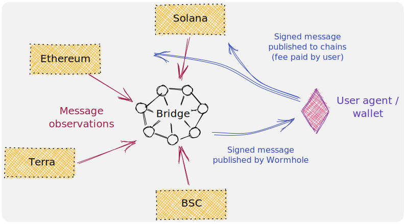

This monorepo contains the reference implementation of the [Wormhole protocol](https://wormholenetwork.com).

To learn about how to use and build on Wormhole read the [docs](https://docs.wormhole.com/).

----

See [Live Contracts](https://docs.wormholenetwork.com/wormhole/contracts) for current testnet and mainnet deployments of
the Wormhole smart contracts.

See [DEVELOP.md](DEVELOP.md) for instructions on how to set up a local devnet, [CONTRIBUTING.md](CONTRIBUTING.md) for instructions on how to contribute to this project, and [SECURITY.md](SECURITY.md) for more information about our security audits and bug bounty program.

See [docs/operations.md](docs/operations.md) for node operator instructions.

⚠ **This software is distributed on an "AS IS" BASIS, WITHOUT WARRANTIES OR CONDITIONS OF ANY KIND, either express or
implied. See the License for the specific language governing permissions and limitations under the License.** Or plainly
spoken - this is a very complex piece of software which targets a bleeding-edge, experimental smart contract runtime.
Mistakes happen, and no matter how hard you try and whether you pay someone to audit it, it may eat your tokens, set
your printer on fire or startle your cat. Cryptocurrencies are a high-risk investment, no matter how fancy.
