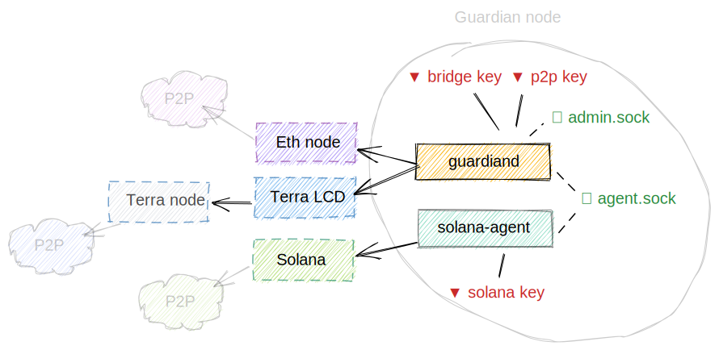

# Running a Wormhole node



## Connected chains

In addition to Wormhole itself, you need to run your own verifying node for every chain that Wormhole connects to:

- **Solana**. There is no light client for Solana yet, so you'll have to run a full solana-validator node. It does not
  have to actually be a validator - you can run solana-validator in non-validating mode if you are not a validator.

  Refer to the [Solana documentation](https://docs.solana.com/running-validator) on how to run a validator. The validator
  requirements as stated in their docs are excessive - for the current iteration for mainnet-beta, the "low end" config
  with no GPU is perfectly adequate, and will have enough spare capacity.
  [Solana's Discord server](https://solana.com/community) is a great resource for questions regarding validator ops.

- **Ethereum**. See below - you need at least a light client. For stability reasons, a full node is recommended.

- **Terra** requires a full node and an [LCD server](https://docs.terra.money/terracli/lcd.html#light-client-daemon)
  pointing to your full node. Refer to the [Terra documentation](https://docs.terra.money/node/join-network.html)
  on how to run a full node. From a security point of view, running only an LCD server with `--trust-node=false` pointed
  to somebody else's full node would be sufficient, but you'd then depend on that single node for availability unless
  you set up a load balancer pointing to a set of nodes.

- **Binance Smart Chain**: Same requirements as Ethereum. Note that BSC has higher throughput than Ethereum and
  roughly requires twice as many compute resources.

**Do NOT use third-party RPC service providers** for any of the chains! You'd fully trust them, and they could lie to
you on whether an event has actually been observed. The whole point of Wormhole is not to rely on centralized nodes!

We strongly recommend running your own full nodes for both testnet and mainnet (where applicable)
so you can test changes for your mainnet full nodes and gain operational experience.

### Solana node requirements

Your Solana RPC node needs the following parameters enabled:

```
--enable-rpc-transaction-history
--enable-cpi-and-log-storage
```

`--enable-rpc-transaction-history` enables historic transactions to be retrieved via the *getConfirmedBlock* API,
which is required for Wormhole to find transactions.

`--enable-cpi-and-log-storage` stores metadata about CPI calls.

Be aware that these require extra disk space!

#### Account index

If you use the same RPC node for Wormhole v1, you also need the following additional parameters to speed up
`getProgramAccount` queries:

```
[... see above for other required parameters ...]

--account-index program-id
--account-index-include-key WormT3McKhFJ2RkiGpdw9GKvNCrB2aB54gb2uV9MfQC   # for mainnet
--account-index-include-key 5gQf5AUhAgWYgUCt9ouShm9H7dzzXUsLdssYwe5krKhg  # for testnet
```

Alternatively, if you want to run a general-purpose RPC node with indexes for all programs instead of only Wormhole,
leave out the filtering:

```
--account-index program-id
```

On mainnet, we strongly recommend blacklisting KIN and the token program to speed up catchup:

```
--account-index-exclude-key kinXdEcpDQeHPEuQnqmUgtYykqKGVFq6CeVX5iAHJq6  # Mainnet only
--account-index-exclude-key TokenkegQfeZyiNwAJbNbGKPFXCWuBvf9Ss623VQ5DA  # Mainnet only
```

Note that these indexes require extra disk space and may slow down catchup. The first startup after
adding these parameters will be slow since Solana needs to recreate all indexes.

### Ethereum node requirements

In order to observe events on the Ethereum chain, you need access to an Ethereum RPC endpoint. The most common
choice is geth, but for the sake of diversity, you may want to run something that isn't geth.

With RPC providers such as Alchemy, Infura, etc. you trust those operators to provide you with untampered chain data and
have no way of verifying correctness. Therefore, Wormhole requires either an Ethereum full-node or a light-client. The
node can be operated in the full, quick or light modes with no impact on security or performance of the bridge software.
As long as the node supports the Ethereum JSON RPC API, it will be compatible with the bridge so all major
implementations will work fine.

Generally, full-nodes will work better and be more reliable than light clients which are susceptible to DoS attacks 
since only very few nodes support the light client protocol.

Running a full node typically requires ~500G of SSD storage, 8G of RAM and 4-8 CPU threads (depending on clock
frequency). Light clients have much lower hardware requirements.

## Building guardiand

For security reasons, we do not provide a pre-built binary. You need to check out the repo and build the
guardiand binary from source. A Git repo is much harder to tamper with than release binaries.

To build the Wormhole node, you need [Go](https://golang.org/dl/) >= 1.17.5.

First, check out the version of the Wormhole repo that you want to deploy:

```bash
git clone https://github.com/certusone/wormhole && cd wormhole
git checkout v2.0.x
```

Then, compile the release binary as an unprivileged build user:

```bash
make node
```
    
You'll end up with a `guardiand` binary in `build/`.

Consider these recommendations, not a tutorial to be followed blindly. You'll want to integrate this with your
existing build pipeline. If you need Dockerfile examples, you can take a look at our devnet deployment.

If you want to compile and deploy locally, you can run `sudo make install` to install the binary to /usr/local/bin.

If you deploy using a custom pipeline, you need to set the `CAP_IPC_LOCK` capability on the binary (e.g. doing the
equivalent to `sudo setcap cap_ipc_lock=+ep`) to allow it to lock its memory pages to prevent them from being paged out.
See below on why - this is a generic defense-in-depth mitigation which ensures that process memory is never swapped out
to disk. Please create a GitHub issue if this extra capability represents an operational or compliance concern.

## Key Generation

To generate a guardian key, install guardiand first. If you generate the key on a separate machine, you may want to
compile guardiand only without installing it:

    make node
    sudo setcap cap_ipc_lock=+ep ./build/bin/guardiand

Otherwise, use the same guardiand binary that you compiled using the regular instructions above.

Generate a new key using the `keygen` subcommand:

    guardiand keygen --desc "Testnet key foo" /path/to/your.key

The key file includes a human-readable part which includes the public key hashes and the description.

## Deploying

We strongly recommend a separate user and systemd services for the Wormhole services.

See the separate [wormhole-networks](https://github.com/certusone/wormhole-networks) repository for examples
on how to set up the guardiand unit for a specific network.

You need to open port 8999/udp in your firewall for the P2P network. Nothing else has to be exposed externally.

journalctl can show guardiand's colored output using the `-a` flag for binary output, i.e.: `journalctl -a -f -u guardiand`.

### Kubernetes

Kubernetes deployment is fully supported.

Refer to [devnet/](../devnet) for example k8s deployments as a starting point for your own production deployment. You'll
have to build your own containers. Unless you already run Kubernetes in production, we strongly recommend a traditional
deployment on a dedicated instance - it's easier to understand and troubleshoot.

### Monitoring

Wormhole exposes a status server for readiness and metrics. By default, it listens on port 6060 on localhost.
You can use a command line argument to expose it publicly: `--statusAddr=[::]:6060`.

#### `/readyz`

This endpoint returns a 200 OK status code once the Wormhole node is ready to serve requests. A node is
considered ready as soon as it has successfully connected to all chains and started processing requests.

This is **only for startup signalling** - it will not tell whether it *stopped*
processing requests at some later point. Once it's true, it stays true! Use metrics to figure that out.

#### `/metrics`

This endpoint serves [Prometheus metrics](https://prometheus.io/docs/concepts/data_model/) for alerting and
introspection. We recommend using Prometheus and Alertmanager, but any monitoring tool that can ingest metrics using the
standardized Prometheus exposition format will work.

Once we gained more operational experience with Wormhole, specific recommendations on appropriate symptoms-based
alerting will be documented here.

See [Wormhole.json](../dashboards/Wormhole.json) for an example Grafana dashboard.

**NOTE:** Parsing the log output for monitoring is NOT recommended. Log output is meant for human consumption and are
not considered a stable API. Log messages may be added, modified or removed without notice. Use the metrics :-)

## Running a public API endpoint

Wormhole v2 no longer uses Solana as a data availability layer (see [design document](../whitepapers/0005_data_availability.md)).
Instead, it relies on Guardian nodes exposing an API which web wallets and other clients can use to retrieve the signed VAA
message for a given transaction.

Guardian nodes are **strongly encouraged** to expose a public API endpoint to improve the protocol's robustness.

guardiand comes with a built-in REST and grpc-web server which can be enabled using the `--publicWeb` flag:

```
--publicWeb=[::]:443
```

For usage with web wallets, TLS needs to be supported. guardiand has built-in Let's Encrypt support:

```
--tlsHostname=wormhole-v2-mainnet-api.example.com
--tlsProdEnv=true
```

Alternatively, you can use a managed reverse proxy like CloudFlare to terminate TLS.

It is safe to expose the publicWeb port on signing nodes. For better resiliency against denial of service attacks,
future guardiand releases will include listen-only mode such that multiple guardiand instances without guardian keys
can be operated behind a load balancer.

### Binding to privileged ports

If you want to bind `--publicWeb` to a port <1024, you need to assign the CAP_NET_BIND_SERVICE capability.
This can be accomplished by either adding the capability to the binary (like in non-systemd environments):

     sudo setcap cap_net_bind_service=+ep guardiand

...or by extending the capability set in `guardiand.service`:

    AmbientCapabilities=CAP_IPC_LOCK CAP_NET_BIND_SERVICE
    CapabilityBoundingSet=CAP_IPC_LOCK CAP_NET_BIND_SERVICE

## Key Management

You'll have to manage the following keys:

 - The **guardian key**, which is the bridge consensus key. This key is very critical - your node uses it to certify
   VAA messages. The public key's hash is stored in the guardian set on all connected chains. It does not accrue rewards.
   It's your share of the multisig mechanism that protect the Wormhole network. The guardian set can be replaced
   if a majority of the guardians agree to sign and publish a new guardian set.
  
 - A **node key**, which identifies it on the gossip network, similar to Solana's node identity or a Tendermint
   node key. It is used by the peer-to-peer network for routing and transport layer encryption.
   An attacker could potentially use it to censor your messages on the network. Other than that, it's not very
   critical and can be rotated. The node will automatically create a node key at the path you specify if it doesn't exist.
   While the node key can be replaced, we recommend using a persistent node key. This will make it easier to identify your
   node in monitoring data and improves p2p connectivity.
 
For production, we strongly recommend to either encrypt your disks, and/or take care to never have hot guardian keys touch the disk.
One way to accomplish is to store keys on an in-memory ramfs, which can't be swapped out, and restore it from cold
storage or an HSM/vault whenever the node is rebooted. You might want to disable swap altogether. None of that is
specific to Wormhole - this applies to any hot keys.

Our node software takes extra care to lock memory using mlock(2) to prevent keys from being swapped out to disk, which
is why it requires extra capabilities. Yes, other chains might want to do this too :-)

Storing keys on an HSM or using remote signers only partially mitigates the risk of server compromise - it means the key
can't get stolen, but an attacker could still cause the HSM to sign malicious payloads. Future iterations of Wormhole
may include support for remote signing using a signer like [SignOS](https://certus.one/sign-os/).
