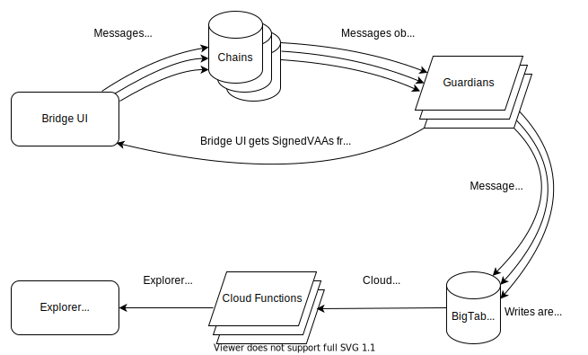

# Centralized datastore for Wormhole visualizations

## Objective

Persist transient Guardian events in a database along with on-chain data, for easier introspection via a block-explorer style GUI.

## Background

Events observed and broadcast between Guardians are transient. Before a message is fully attested by the Guardians, an end user has no way to determine where within the lifecycle of attestation their event is. Saving the attestation state along with the message identifiers would allow the development of discovery interfaces.

Building a GUI that would allow querying and viewing Wormhole data by a single on-chain identifier would make using the Wormhole a friendlier experience. Building such a GUI would be difficult without an off-chain datastore that captures the entire lifecycle of Wormhole events.

## Goals

- Persist user intent with the relevant metadata (sender address, transaction hash/signature).
- Expose the Guardian network's Verifiable Action Approval state. Individual Signatures and if/when quorum was reached.
- Record the transaction hash/signature of all transactions performed by Guardians relevant to the User's intent.
- Allow querying by a transaction identifier and retrieving associated data.

## Non-Goals

- Centrally persisted Wormhole data does not aim to be a source of truth.
- Centrally persisted Wormhole data will not be publicly available for programmatic consumption.

## Overview

A Guardian can be configured to publish Wormhole events to a database. This will enable a discovery interface for users to query for Wormhole events, along with querying for message counts and statistics.

## Detailed Design

A Google Cloud BigTable instance will be setup to store data about Wormhole events, with the schema described in the following section. BigTable is preferred because it does not require a global schema, along with its ability to efficiently deal with large amounts of historic data by row key sharding.

A block-explorer style web app will use BigTable to retrieve VAA state to create a discovery interface for Wormhole. The explorer web app could allow users to query for Wormhole events by a single identifier, similar to other block explorers, where a user may enter an address or a transaction identifier and see the relevant data.

### API / database schema

BigTable schema: [Wormhole event schema](./bigtable_event_schema.md)

## Caveats

It is undetermined how costly it will be to query for multiple transactions (rows) in the case of bridging tokens. For example, querying to retrieve the `assetMeta` transaction along with `transfer` message transaction.

## Alternatives Considered

### Database schema

Saving each Protobuf SignedObservation as its own row was considered. However, building a picture of the state of the user's intent with only SignedObservations is not ideal, as the logic to interpret the results would need come from somewhere, and additional data would need to be sourced.

Using VAA "digest" as BigTable RowKey was considered. Using the VAA digest would make database writes easy within the existing codebase. However, indexing on digest would heavily penalize reads as the digest will not be known to the user, so a full table scan would be required for every user request.
