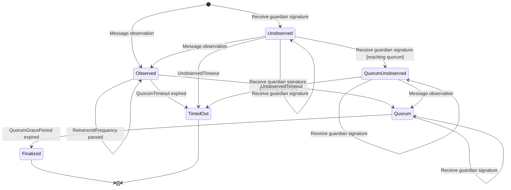

```mermaid
stateDiagram-v2
    [*] --> Observed: Message observation
    Observed --> Observed: Receive guardian signature
    Observed --> Quorum: Receive guardian signature [reaching quorum]
    Quorum --> Finalized: QuorumGracePeriod expired
    Quorum --> Quorum: Receive guardian signature
    Observed --> TimedOut: QuorumTimeout expired
    Observed --> Observed: RetransmitFrequency passed
    
    [*] --> Unobserved: Receive guardian signature
    Unobserved --> Observed: Message observation
    Unobserved --> Unobserved: Receive guardian signature
    Unobserved --> QuorumUnobserved: Receive guardian signature [reaching quorum]
    Unobserved --> TimedOut: UnobservedTimeout
    QuorumUnobserved --> QuorumUnobserved: Receive guardian signature
    QuorumUnobserved --> Quorum: Message observation
    QuorumUnobserved --> TimedOut: UnobservedTimeout
    
    Finalized --> [*] 
    TimedOut --> [*]

```