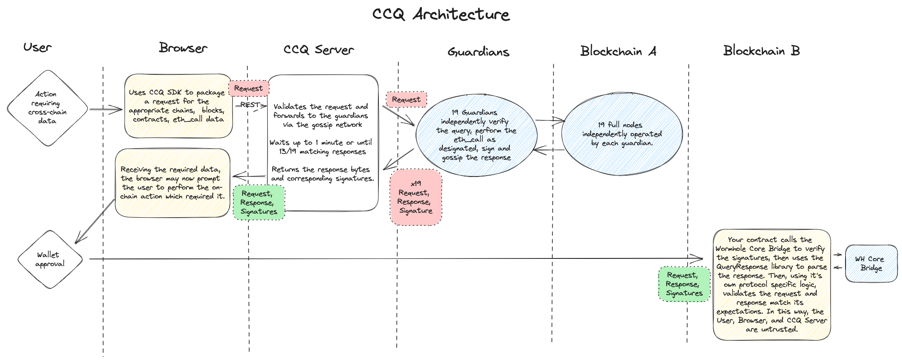

# Cross-Chain Queries (CCQ)

# Objective

Provide a mechanism for integrators to request information and receive an attestation from the guardians about a chain they are connected to.

# Background

As of October 2023, Wormhole currently only supports "push" attestations. For example, in order to get the state of some contract on Ethereum, a smart contract would need to be written and deployed to Ethereum explicitly to read that state and call `publishMessage` on the Core Bridge. Furthermore, any time that data was needed elsewhere, a costly and time-consuming transaction would need to be made.

This design proposes a mechanism to "pull" for attestations. It is desirable to be able to originate these requests on *or* off chain. However, the initial release of CCQ only supports off chain requests.

# Goals

- Establish a mechanism for initiating requests on-chain and off-chain
- Provide a solution for responding to requests
- Provide a generic, extensible solution for describing requests and responses
- Provide a form of request replay-protection
- Provide a form of DoS mitigation
- Provide a format for serialization
- Support batch query requests

# Non-Goals

- Data-availability of query responses (responses will not be persisted)
- Describe all possible implementation-specific query requests or response formats
- Attest to the finality status of the result
- Resolve a tag (`latest`, `safe`, `finalized`, etc.) to a particular block hash or number pre-query
- Relaying of query responses

# Overview

Wormhole guardians run full nodes for many of the connected chains. In the current design, any information desired to be consumed from one of these chains on another chain must be "pushed" by a specially-developed contract on the chain where the data resides. This results in a lag time of landing a transaction as well the cost to execute that transaction on chain. For applications which may only require attestation of state changes cross chain on-demand, the additional complexity and cost to always publish messages is inefficient.

Consider how a token attestation from Ethereum for the [Token Bridge](0003_token_bridge.md) could be different with cross-chain queries. Instead of having to make an Ethereum transaction to the token bridge to call `decimals()`, `symbol()`, and `name()` for a given `tokenAddress` and wait for finality on that transaction, one could make a cross-chain query for the three calls to that contract on Ethereum via the guardians. The cross-chain query could be significantly faster (likely seconds instead of 15-20 minutes) and avoid the need to pay gas on Ethereum.

The CCQ feature adds the ability for integrators to submit a query request to the guardian network, and receive an attested response from the guardians. The guardians listen for these requests, submit them to the appropriate chain, receive the results from the chain, and publish them back to the gossip network. An integrator can then accumulate these requests and correlate the results (applying quorum) and be assured of the veracity of the results.

# Detailed Design

The guardian nodes are at the heart of the CCQ feature. They will be responsible for receiving requests (both on chain and off chain) from integrators, executing them against the appropriate RPC nodes, and returning the results.

Additionally, to facilitate off chain requests, there will be a CCQ query server which will provide a REST endpoint to receive and execute requests against the guardian network. It is possible to have multiple CCQ query servers, each with its own peer ID and signing wallet, which would need to be allow listed on the guardians.

The following diagram shows the basic flow of a query request for a browser based application.



## Guardian Server

CCQ will run as an optional component in `guardiand`. If it is not configured, it will not be enabled. The guardians will process query requests independently. Unlike observations, the guardians will not listen to or process CCQ traffic from each other. Each guardian will receive the request, process it, and if it is valid, do the query and publish the result. If a request is not valid, the guardian will simply drop the request without responding.

### Listening for requests

The request format is extensible in order to support querying data across heterogeneous chains and batching of requests to minimize gossip traffic and RPC overhead.

The current release of CCQ, as of February 2024, supports EVM chains and Solana. However, the software is extensible to other chains, such as CosmWasm, etc.

#### Off-Chain Requests

The guardian will listen for off chain requests over P2P gossip. To minimize overhead, CCQ will use a separate P2P channel from existing gossip. This way, any guardians that
do not have CCQ enabled, as well as other applications listening to gossip (such as spies and flies) will not see any CCQ traffic.

The CCQ channel will use two topics,
`ccq_req` and `ccq_resp`. The guardians will subscribe to both but only join `ccq_req`. This means that guardians will see all requests, but none of the responses.

The guardian will use the P2P `WithPeerFilter` and `RegisterTopicValidator` filters to only accept P2P traffic from allow listed peers.

The guardian will listen for requests on the `ccq_req` topic. When a request is received, it will be submitted to the query module for processing.

#### On-Chain Requests

The initial release of CCQ will not support on chain requests.

Requests could be made on-chain from supported chains via a new cross-chain query contract. This contract could construct a payload representing the requester and request, and publish it via the core bridge, generating a standard VAA. Guardians could have a pre-defined list of these emitters to treat as cross-chain query requests and process the requests accordingly.

### Request Validation

The query module will perform request validation consisting of the following:

- Verify the signature. This includes verifying the request was signed with the right prefix, so that requests from other environments can't be replayed
  (for example, a testnet message cannot be played in mainnet).
- Verify that the signer is allowed to execute CCQ requests (is allow listed).
- Verify that all of the per-chain requests contained in the query are valid.

#### Block ID in eth_call Queries

Note that for `eth_call` queries, the `block_id` must be either a block number or block hash. Tags like `latest` or `finalized` are not supported. This is because different guardians may well have a different value for either `latest` or `finalized`, depending on the
state of their nodes.

Note that there may be a need to support the use of tags like `latest` and `finalized`, which may require gossiping block numbers or having the query server read the data. This will be handled as a follow on feature.

#### Timestamp and Block ID Hints in eth_call_by_timestamp

Note that for `eth_call_by_timestamp` queries, the `timestamp` must be specified. Additionally, the `hint_target_block_id` and `hint_following_block_id` may be specified to assist the guardians in scoping the query. Note that if one of the two is specified, they both must be specified. The format of the hints is the same as the `block_id` in `eth_call`.

#### Desired Finality in eth_call_with_finality

Note that for `eth_call_with_finality` queries, the `finality` must be specified. The only valid values are `finalized` and `safe`. The `block_id` is required and has the same format as in `eth_call`.

#### Signature Verification

Requests messages MUST include a signature in the payload in order to distinguish between a requester and (potentially, third-party) p2p relayer.
That signature SHOULD be created using a separate key.

In order to differentiate signatures and prevent replay attacks of requests intended for devnet/testnet from mainnet ones, the following prefixes MUST be used when signing. These prefix strings are padded to 35-bytes to align with [Guardian Key Usage](0009_guardian_key.md) and existing code.

```
mainnet_query_request_000000000000|
testnet_query_request_000000000000|
devnet_query_request_0000000000000|

```

#### Solana Support

An experimental implementation of queries for Solana is being added as of January, 2024. This implementation is considered experimental because Solana does not natively support reading account data for a specific slot number, meaning each guardiand watcher will return data for its version of the most recent slot, possibly making it difficult to reach consensus. The plan is to deploy this to mainnet so that we can experiment with various ways to achieve consensus.

### Request Execution

Once the request has been validated, the query module will submit the individual per-chain query requests to the appropriate watchers for execution. The watchers will submit the RPC calls
to the node and return the results. Communication between the query module and the watchers is via a pair of golang channels per watcher, one inbound and one outbound. The watchers will
use batch requests to minimize RPC overhead. For this to work effectively, the integrator should properly group RPC calls into the minimal set of per-chain queries.

For `eth_call_with_finality` requests, the watcher will not return the result until the requested block as reached the desired level of finality. Also, on chains that do not publish safe blocks, a request for a finality of "safe" will be treated as "finalized" rather than throwing an error.

The query module will listen for responses for all of the per-chain queries. When all per-chain responses are received, the module will post the result to be published on the gossip network.
If any of the responses fails or times out, the query module will retry periodically for up to one minute. If after a minute some of the per-chain queries were not successful, the query
module will drop the request.

Note that the guardians do not respond to bad requests to minimize the DoS attack vector. If they did respond, a malicious user could pummel the gossip network with bad requests, which would be multiplied by numerous error responses per request. The CCQ query server does request validation and responds with an error if it detects a bad request.

### Publication of Responses

If and only if the request is successfully processed, the guardian will publish a query response message over P2P using the `ccq_resp` topic. As noted
previously, the other guardians will not see this message. Only the REST server and possibly third party integrators will see it.

The query response contains both the initial query request and the results. The presence of the request allows the integrator to verify the response is what they are expecting.

The response should be signed with the prefix `query_response_0000000000000000000|`. Note that it is not necessary to have different response prefixes for each environment because
the responses are signed with the guardian key, which is different between the environments.

### Guardian Configuration

The guardian configuration for CCQ will consist of the following config parameters.

- `ccqEnabled` - if set to `true` then the CCQ feature is enabled. Default is false.
- `ccqAllowedRequesters` - comma separated list of signer public keys who are allowed to submit query requests. No default.
- `ccqP2pPort` - local port used to bind the CCQ P2P channel, default is `8996`.
- `ccqP2pBootstrap` - bootstrap peers for the CCQ P2P channel. No default (but auto generated in tilt).
- `ccqAllowedPeers` - comma separated list of P2P peer IDs that are allowed to submit query requests.

### No Query Persistence in the Guardian

In order to reduce the storage burden on the guardian node, full responses are not persisted in the guardian. However, to facilitate de-duplication and authorization, some cross-chain query information may be committed to Gateway (Wormchain).

## CCQ REST Server

Some integrators might choose to communicate directly with the guardians by encoding their own query requests and publishing them to the gossip network. To do so would require their P2P peer ID to be configured on the guardians. Additionally they would need to have a P2P library, which limits their choices (For instance, there does not currently exist a typescript library for P2P). Additionally, the integrator would need to collect and consolidate the responses.

For these and other reasons, a separate REST server is being provided to accept off-chain query requests, submit them to the gossip network, correlate the responses, and return them to the caller.

The CCQ server will be configured to publish and listen on the CCQ P2P network. It's P2P peer ID will be registered with the guardians. The server will join both `ccq_req` and `ccq_resp` but only subscribe to `ccq_resp`.

The server will be configured with a list of supported users. Each user will have an API Key, as well as a list of what queries they are allowed to perform.
The query data per user will look something like this:

```
{
    "userName": "Test User",
    "apiKey": "432185ac-fbb7-4883-b68d-888e7bd749a9",
    "allowUnsigned": true,
    "allowedCalls": [
    {
        "ethCall": {
        "note:": "Name of WETH on Goerli",
        "chain": 2,
        "contractAddress": "B4FBF271143F4FBf7B91A5ded31805e42b2208d6",
        "call": "0x06fdde03"
        }
    }
    ]
}
```

When a user submits a query, they will need to set the `X-API-Key` header in the request.

The server will only accept requests from configured users. Those requests may only be for the RPC calls configured in the `allowedCalls` list.

Each allowed call is specified by:

- Target wormhole chain ID
- Target contract address on that chain
- The first four bytes of the hash of signature of the method to be called.

All configured users may submit queries that they sign with their own key. In addition to signed requests, if the `allowUnsigned` flag is set to `true`, the user may submit unsigned requests and the server will sign them using a pre-configured key. Note that all keys must be in the guardian allow list.

## Typescript Library

To assist integrators, there is a typescript library in `sdk/js-query` that provides methods for building queries. Additionally, there are some usage examples in `sdk/js-query/src/query/ethCall.test.ts`.

## EVM Response Parsing Library

Once a response has been received, the integrator needs to validate and parse it to get the results. There is a simple EVM library to facilitate this which can be found in
`ethereum/contracts/query/QueryResponse.sol`. A usage example is in `ethereum/forge-test/query/Query.t.sol`.

## Core Bridge Optimization

The `QueryResponse` parsing library uses the `Wormhole Core` contract to verify the signatures on the response. This currently involves making four cross contract calls, wasting gas.
A desirable optimization is to add a new public method to the `Wormhole` contract that would take a payload (the response bytes) and the set of signatures, and do the verification in a single call. It should revert if the signature is not valid.

# Specification

## Query Request

### Off-Chain

```go
u8       version
u32      nonce
u8       num_per_chain_queries
[]byte   per_chain_queries
```

### Per-Chain Query

Multiple queries for the same chain may be submitted in a single `Per-Chain Query`.

```go
u16      chain_id
u8       type
uint32   query_len
[]byte   query_data
```

#### EVM Queries

Currently the supported query types on EVM are `eth_call`, `eth_call_by_timestamp` and `eth_call_with_finality`. This can be expanded to support other protocols.

1. eth_call (query type 1)

   ```go
   u32      block_id_len
   []byte   block_id
   u8       num_batch_call_data
   []byte   batch_call_data
   ```

   Calls are batched to allow specifying multiple calls against the same block. These will be done in the same batch RPC call and are easier for the requester to verify on chain.

   ```go
   [20]byte   contract_address
   u32        call_data_len
   []byte     call_data
   ```

2. eth_call_by_timestamp (query type 2)

   This query type is similar to `eth_call` but targets a timestamp instead of a specific block_id. This can be useful when forming requests based on uncorrelated data, such as requiring data from another chain based on the block timestamp of a given chain.

   The request MUST include the target timestamp.

   In the initial release of CCQ, the request had to include the block hints for the target block and following block. These hints are used by the guardians to look up the blocks.

   As of December 2023, the block hints are optional, as the guardian maintains a cache of block timestamp to block number. This cache is guaranteed to cover the last 30 minutes of blocks, which is back filled on start up. As new blocks come in, they are added to the cache, so it may well cover more than 30 minutes. (The most recent 10000 blocks are maintained.) If a request is received that does not have the hints and the timestamp is before the oldest entry in the cache, the request is rejected.

   The resulting block numbers MUST be `1` different and their timestamps MUST be such that the target block is _before_ the target time (inclusive) and the following block is _after_ (exclusive). In other words,

   ```
   target_block.timestamp <= target_time < following_block.timestamp
   and
   following_block_num - 1 == target_block_num
   ```

   The guardian code MUST enforce the above condition before signing the result.

   ```go
   u64      target_time_us
   u32      target_block_id_hint_len
   []byte   target_block_id_hint
   u32      following_block_id_hint_len
   []byte   following_block_id_hint
   u8       num_batch_call_data
   []byte   batch_call_data
   ```

3. eth_call_with_finality (query type 3)

   This query type is similar to `eth_call` but ensures that the specified block has reached the specified finality before returning the query results. The finality may be "finalized" or "safe". Note that "safe" is only supported on chains that publish safe blocks. The request MUST include the both the block_id and the finality.

   The guardian code MUST enforce the finality before signing the result.

   ```go
   u32      block_id_len
   []byte   block_id
   u32      finality_len
   []byte   finality
   u8       num_batch_call_data
   []byte   batch_call_data
   ```

#### Solana Queries

Currently the only supported query type on Solana is `sol_account`.

1. sol_account (query type 4) - this query is used to read data for one or more accounts on Solana.

   ```go
   u32         commitment_len
   []byte      commitment
   u64         min_context_slot
   u64         data_slice_offset
   u64         data_slice_length
   u8          num_accounts
   [][32]byte  account_list
   ```

   - The `commitment` is required and currently must be `finalized`.

   - The `min_context_slot` is optional and specifies the minimum slot at which the request may be evaluated.

   - The `data_slice_offset` and `data_slice_length` are optional and specify the portion of the account data that should be returned.

   - The `account_list` specifies a list of accounts to be batched into a single query. Each account in the list is a Solana `PublicKey`

2. sol_pda (query type 5) - this query is used to read data for one or more accounts on Solana based on their Program Derived Addresses.

   ```go
   u32         commitment_len
   []byte      commitment
   u64         min_context_slot
   u64         data_slice_offset
   u64         data_slice_length
   u8          num_pdas
   []PdaList   pda_list
   ```

   - The `commitment` is required and currently must be `finalized`.

   - The `min_context_slot` is optional and specifies the minimum slot at which the request may be evaluated.

   - The `data_slice_offset` and `data_slice_length` are optional and specify the portion of the account data that should be returned.

   - The `pda_list` specifies a list of program derived addresses batched into a single query.

     `PdaList` is defined as follows:

     ```go
     [32]byte      program_address
     u8            num_seeds
     []Seed        seed_data (max of 16, per the Solana code)
     ```

     Each `Seed` is defined as follows:

     ```go
     u32           seed_len (max of 32, per the Solana code)
     []byte        seed
     ```

## Query Response

- Off-Chain
  ```go
  u8         version
  u16        sender_chain_id = 0
  [65]byte   signature
  u32        query_request_len
  []byte     query_request
  u8         num_per_chain_responses
  []byte     per_chain_responses
  ```
- On-Chain [WIP] - depends on whether the request is done via VAA or not, this could be chain/emitter/sequence but that wouldn’t work with faster-than-finality
  ```go
  u16        sender_chain_id != 0
  [32]byte   vaa_hash
  []byte     query_request
  u8         num_per_chain_responses
  []byte     per_chain_responses
  ```

### Per-Chain Responses

All per-chain responses begin with following header.

```go
u16     chain_id
u8      type
uint32  response_len
[]byte  response
```

#### EVM Query Responses

1. eth_call (query type 1) Response Body

   ```go
   u64         block_number
   [32]byte    block_hash
   u64         block_time_us
   u8          num_results
   []byte      results
   ```

   ```go
   u32         result_len
   []byte      result
   ```

2. eth_call_by_timestamp (query type 2) Response Body

   ```go
   u64         target_block_number
   [32]byte    target_block_hash
   u64         target_block_time_us
   u64         following_block_number
   [32]byte    following_block_hash
   u64         following_block_time_us
   u8          num_results
   []byte      results
   ```

   ```go
   u32         result_len
   []byte      result
   ```

3. eth_call_with_finality (query type 3) Response Body
   The response for `eth_call_with_finality` is the same as the response for `eth_call`, although the query type will be three instead of one.

#### Solana Query Responses

1. sol_account (query type 4) Response Body

   ```go
   u64         slot_number
   u64         block_time_us
   [32]byte    block_hash
   u8          num_results
   []byte      results
   ```

   - The `slot_number` is the slot number returned by the query.
   - The `block_time_us` is the timestamp of the block associated with the slot.
   - The `block_hash` is the block hash associated with the slot.
   - The `results` array returns the data for each account queried

   ```go
   u64         lamports
   u64         rent_epoch
   u8          executable
   [32]byte    owner
   u32         result_len
   []byte      result
   ```

   - The `lamports` is the number of lamports assigned to the account.
   - The `rent_epoch` is the epoch at which this account will next owe rent.
   - The `executable` is a boolean indicating if the account contains a program (and is strictly read-only).
   - The `owner` is the public key of the owner of the account.
   - The `result` is the data returned by the account query.

2. sol_pda (query type 5) Response Body

   ```go
   u64         slot_number
   u64         block_time_us
   [32]byte    block_hash
   u8          num_results
   []byte      results
   ```

   - The `slot_number` is the slot number returned by the query.
   - The `block_time_us` is the timestamp of the block associated with the slot.
   - The `block_hash` is the block hash associated with the slot.
   - The `results` array returns the data for each PDA queried

   ```go
   [32]byte    account
   u8          bump
   u64         lamports
   u64         rent_epoch
   u8          executable
   [32]byte    owner
   u32         result_len
   []byte      result
   ```

   - The `account` is the account address derived from the PDA.
   - The `bump` is the bump value returned by the Solana derivation function.
   - The `lamports` is the number of lamports assigned to the account.
   - The `rent_epoch` is the epoch at which this account will next owe rent.
   - The `executable` is a boolean indicating if the account contains a program (and is strictly read-only).
   - The `owner` is the public key of the owner of the account.
   - The `result` is the data returned by the account query.

## REST Service

### Request

```ts
export interface QueryRequest {
  bytes: string; // As a hex string
  signatures?: string; // As a hex string
}
```

Note that the signature may be omitted if the user is provisioned to allow unsigned requests in the CCQ server configuration. In that case,
the CCQ server will sign the request.

#### Request Headers

The requests must include the following header.

- "X-API-Key" must match what is configured on the CCQ server.

### Response

- 200 - request reached consensus in < 1m

  - Signatures is the ECDSA signature + a byte for the index of the guardian in the guardian set
  - Signatures will appear in increasing set index order

  ```ts
  export interface QueryResponse {
    bytes: string; // As a hex string
    signatures?: string; // As a hex string
  }
  ```

- 400 - bad request (malformed input or bytes)
- 401 - authorization required (missing API key)
- 403 - forbidden (invalid API key)
- 500 - [future] failed to reach consensus (e.g. received 14 responses but 7 with one result and 7 with another)
- 504 - did not reach consensus in < 1m

# Rollout Considerations

Testing against the testnet guardian may not give us an accurate read of gathering consensus or hitting production nodes - there’s only one guardian and it relies on some public and third-party provider nodes.

For demo purposes, a stand alone GCP VM has been set up to host both a guardian and REST server.

# Security Considerations

## DoS Mitigation

The following are being done to reduce the denial of service threat surface:

- CCQ uses a separate P2P channel.
- The guardians only listen to CCQ requests on that channel, not responses.
- The guardians do P2P peer ID filtering, so only configured hosts can communicate with the guardians.
- Only configured wallets can sign requests.
- Invalid requests are dropped without a gossip response.

Note that to prevent requests from creating undue load on guardians' RPC nodes, a mechanism may be needed to rate-limit or impose service fees upon requesters.

## Replay Protection

By using separate signing keys for each environment (devnet vs. testnet vs. mainnet), requests cannot be replayed across environments.

## Signer Allow Listing

Only configured wallets are allowed to sign requests.

Additionally only configured API keys can submit requests to the REST endpoint.
