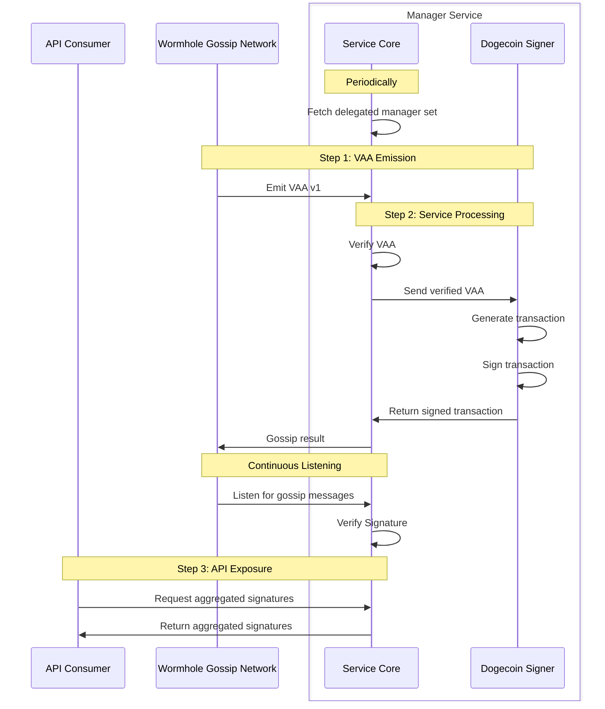

# Manager Service

## Objective

Enable a bi-directional bridge for chains which do not have smart contract support. This design focuses on the Guardian funds management delegation and procedure for locking and unlocking funds on Dogecoin but may be extended for other chains.

## Background

Dogecoin, a [UTXO](https://en.wikipedia.org/wiki/Unspent_transaction_output)-based chain originally based on Litecoin that [implements](https://github.com/dogecoin/dogecoin/blob/master/doc/bips.md) several Bitcoin protocols, does not support a smart contract runtime, so options are limited. However, [P2SH](https://learnmeabitcoin.com/technical/script/p2sh/) provides a mechanism to lock up coins to the result of a script.

[P2WSH](https://learnmeabitcoin.com/technical/script/p2wsh/) (Segregated Witness) is not available on Dogecoin.

> ⚠️ The maximum size of a Redeem Script is **520 bytes** and a ScriptSig limit is **1650 bytes**. Given those limits along with the header in this design, the largest multisig to maintain a 2/3+ majority would be 9/13. Fees are based on transaction size, so this should also be taken into consideration.

## Goals

- Officially and publicly delegate fund manager signing authority to a set of public keys for the purposes of bridging to (i.e. unlocking) Dogecoin.
  - This should require a new governance by the canonical guardian set and be maintained on-chain.
  - This should be reusable by other chains that require a fund manager implementation - e.g. Bitcoin, XRPL - but be flexible per-chain.
- Trigger signing by this delegated set based on a VAA.
- Make the resulting signature(s) and artifact publicly available.

## Non-Goals

- Migration of UTXOs for manager set migration - the integrating protocol should consider an underlying mechanism to transition UTXOs to an updated redeem script.
- Relaying
- Payment for the manager service

## Overview

The new Wormhole Guardian Manager Service overview



## Detailed Design

### Technical Details

In sending from Dogecoin to Solana, funds are locked by a redeem script that can only be accessed by a signer (or set of signers). These signers should represent guardian fund management - the expectation being that only a legitimate withdrawal witnessed by the guardians should transfer out the funds. The primary difference between this and the existing functionality of Wormhole is that 1) the guardians do not directly hold funds, but rather smart contracts do and 2) those smart contracts verify guardian signatures against generic messages (VAAs) and transfer out the funds based on their validation of that message.

This design purposely leaves the complexity of UTXO management to the integrator. A contract or off-chain service of the integrating protocol must determine the appropriate UTXO management prior to emitting a VAA. The gap here is then translating that VAA into a signed transaction that can release the funds on Dogecoin - effectively taking the place of the smart contract outbound transfer functionality on traditional Wormhole-supported chains. Ideally, the approach implemented here would be modular enough to allow support for other runtimes which do not feature sufficient smart contract support.

This requires the following:

1. Fetching the current delegated manager set for the configured chains. (Optional)
2. Verifying a VAA against the current guardian set.
3. Generating and signing a Dogecoin transaction.
4. Storing and distributing the resulting signature.
5. Aggregating the signatures and making them publicly accessible.

This design introduces the following new concepts:

- **Delegated Manager Set** - A set of public keys to which the canonical guardians have indicated are trusted to manage funds for chains without sufficient smart contract support. Due to technical limitations, feature evolution, or other tradeoffs, this may have a different number of keys compared to the guardian set.
- **Manager Service** - An optional guardian service module to dispatch signature requests, aggregate signature responses, and serve resulting signatures and transactions.
- **Chain-Specific Signing Service** - A modular component of the Manager Service which parses a VAA and performs chain-specific steps to form a transaction and sign it. This may or may not involve coordination with the other guardians. That coordination is outside the scope of this design, as it is not required for Dogecoin.

### Protocol Integration

The guardian can be extended to optionally run a new Manager Service. This would include the functionality detailed above. The operator would not necessarily need to be part of the canonical guardian set in order to run the service.

#### 0. Delegated Manager Set Governance (Optional)

A new module can be added for `DelegatedManager` along with a governance action for `DelegateSetUpdate`. These should work similar to the existing guardian set update action, with the following exceptions.

- Delegated Manager needs to be assigned on a per-chain basis. This should be designated by a `uint16` like a standard Wormhole Chain ID.
- Address representations for other chains may not always use 20-bytes like the existing guardian public keys. To support different address implementations per-chain, the address information will need to be stored generically as `bytes`. As even those formats may change depending on implementation-specific designations, a 1-byte prefix should be used to differentiate representation standards.

A new immutable contract can be deployed to verify and store these on-chain. It should be forward-compatible, and therefore should not parse the internal set bytes. It must expose the following:

- `submitNewManagerSet(bytes memory _vm)` this should be akin to `submitNewGuardianSet` on the Core bridge, except store the set and latest set index per-chain
- `getManagerSet(uint16 chainId, uint32 index)`
- `getCurrentManagerSetIndex(uint16 chainId)`
- `getCurrentManagerSet(uint16 chainId)`

This is technically optional, as the rest of the steps would work without it, but making the set transparent to integrators may ease integration and increase transparency.

#### 1. Fetching the Delegated Manager Set (Optional)

The guardian’s Ethereum watcher can be extended to support fetching of the delegated manager set akin to how the guardian set is currently fetched.

#### 2. Verifying a VAA against the Current Guardian Set

The Manager Service will need access to the current guardian set (`gst`). It should also have a new channel to ingest certain VAAs when the guardian broadcasts or receives them. For an MVP, it is recommended to have a hardcoded config of which chain-emitter pairs are forwarded, akin to Governor and Accountant. For defense-in-depth, this chain-emitter pair should be checked in both the forwarding code (likely the p2p module) and receiving code in the Manager Service. **Critically**, this configuration must also include what signer the emitter should be forwarded to. This is necessary to avoid any message confusion between signers - e.g. a Dogecoin emitter should never be able to trigger an XRPL signature.

After checking the message against the config, the Manager Signer should verify the VAA (unless the VAA is guaranteed to have already been verified by the code path) and forward it to the chain-specific signing service.

> 💡 Not all guardians subscribe to the VAA gossip channel. This is controlled by an optional flag `subscribeToVAAs`. If a guardian is acting as a manager and does not subscribe to VAAs, they would only produce signatures for messages they observed, as the guardian will only form VAAs for messages they observed.

#### 3. Generating and Signing a Dogecoin Transaction

The Chain-Specific Signing Service for Dogecoin must parse the VAA and its payload to extract the necessary fields. It must then construct the resulting redeem script and transaction, sign, and return the signed transaction to the Manager Service. In order to avoid coordination between the different Manager Services, the process to convert a VAA to a transaction must be deterministic.

#### 4. Storing and Distributing Signatures

Upon receipt of a signature and transaction from the Chain-Specific Signing Service, the Manager Service must store the signature and transaction indexed by the VAA that generated it. This should be indexed by both the VAA hash (which is unique) and the VAA ID (`{chain}/{emitter}/{sequence}`) for ease of integrator lookup. It must also send the signed transaction over gossip to the other Manager Services. In order to reduce traffic to non-manager guardians, this must use a new gossip channel.

#### 5. Signature Aggregation and Availability

A guardian running a Manager Service may subscribe to this new gossip channel in order to aggregate signatures. Upon receipt of a signed transaction, the receiving guardian must verify that the signature recovers to one of the public keys in the manager set and, if a transaction is already stored, validate that this transaction matches the existing one for the same VAA hash. A valid signed transaction must be upserted - critically, the signatures must be stored in the order they appear in the manager set.

#### Explorer Integration

Wormholescan may want to consider monitoring the new gossip channel and aggregating signatures as well.

### API / database schema

#### Delegated Manager Governance

See [Cross-Chain Governance Decision Messaging](./0002_governance_messaging.md#general-packet-structure) for more information.

```go
// ManagerSetUpgrade is a VAA that instructs an implementation to upgrade the current manager set
ManagerSetUpgrade struct {
    // Core Wormhole Module
    Module [32]byte = "DelegatedManager"
    // Action index (2 for GuardianSet Upgrade)
    Action uint8 = 1
    // This update is chain independent
    Chain uint16 = 0

		// Manager Chain ID
		ManagerChainId uint16
    // New ManagerSet
    NewManagerSetIndex uint32
    // New ManagerSet
    NewManagerSet []byte
}
```

For Dogecoin, this set would be represented by the following struct

```go
NewManagerSet struct {
    // Manager Set Type - Equal-Weight Compressed secp256k1 Public Key Multisig
    Type uint8 = 1
    // Number of valid signatures required
    M uint8
    // Number of public keys
    N uint8
    // Compressed secp256k1 public keys (length determined by N)
    PublicKeys [][33]byte
}
```

#### Redeem Script

The following redeem script must be used in order for the manager set to unlock the funds.

- The emitter chain and contract must match the emitter of the VAA that will be allowed to unlock the funds.
- The recipient address is required by the deposit contract on the destination chain to determine what account to mint the tokens to - e.g. on Solana.

```jsx
<emitter_chain>     (2 bytes, u16 BE)
<emitter_contract>  (32 bytes)
OP_2DROP
<recipient_address> (32 bytes)
OP_DROP
OP_M <pubkeys...> OP_N OP_CHECKMULTISIG
```

#### Dogecoin Unlock VAA Payload

The following payload can be emitted by a registered emitter in order to trigger Manager Service signing. This payload is specific to UTXO chains, such as Bitcoin and Dogecoin, **_as well as_** being specific to the redeem script specified above. It contains all of the information necessary for the manager set to _independently, asynchronously, and deterministically_ generate and sign the same transaction.

> 📝 All `uint` values are encoded big-endian (including the deposit transaction_id).

```solidity
bytes4   prefix = "UTX0";       // 4-byte prefix for this struct
uint16   destination_chain;     // Wormhole Chain ID
uint32   delegated_manager_set; // Delegated Manager Set Index
uint32   len_input;
[]input  inputs;
uint32   len_output;
[]output outputs;
```

Where `input` is

```solidity
bytes32 original_recipient_address; // The recipient address in the redeem script
bytes32 transaction_id;             // The deposit transaction
uint32  vout;                       // The vout index of the deposit transaction
```

and `output` is

```solidity
uint64 amount;
uint32 address_type; // enum 0 = P2PKH, 1 = P2SH
[n]byte  address;    // n = 20 for P2PKH/P2SH/P2WPKH, 32 for P2WSH/P2TR
```

#### Manager Service API

The Manager Service will expose two public endpoints.

```go
GET /v1/manager/signed_vaa/{chain}/{emitter}/{sequence}
GET /v1/manager/signed_vaa/{hash}
```

They both return the following output:

```typescript
type GetSignedManagerTransactionResponse = {
  vaaHash: string;
  vaaId: string;
  destinationChain: number;
  managerSetIndex: number;
  required: number;
  total: number;
  isComplete: boolean;
  signatures: {
    signerIndex: number;
    signatures: string[];
  }[];
};
```

The `vaaHash` is in hex without a `0x` prefix, the `vaaId` is in the standard `{chain}/{emitter}/{sequence}` format, and `signatures` are base64.

## Caveats

This design does NOT explicitly require that the Delegated Manager Set participants are part of the canonical guardian set.

Integrating protocols must be aware of Delegated Manager Set upgrades by the canonical Guardian Set and act promptly to migrate to the new Delegated Manager Set. There is no inherent requirement for a given Delegated Manager Set to remain operational for any specific period of time in this design, but it should be expected that signers in the prior set remain operational for some period of time to facilitate migrations. Protocols may rely on the Delegated Manager Set Governance VAA to permissionlessly facilitate migration. A smart contract may be made available to verify and store this on-chain as described in [0. Delegated Manager Set Governance (Optional)](#0-delegated-manager-set-governance-optional).

As mentioned above, UTXO management is left up to the integrating protocol prior to message emission. It is anticipated that protocols would subtract fees from withdrawals and send any remaining amounts back to their protocol by sending to the P2SH address of the redeem script above with their chain and emitter but a zero `recipient_address`. Their protocol would _not_ mint and tokens on these deposits. This zero address approach can also be used by the protocol to arbitrarily consolidate UTXOs in addition to performing Delegated Manager Set rotations.

## Alternatives Considered

### Direct Observations

The Manager Service could directly witness messages generated on-chain and bypass the canonical guardian observations. The VAA v1 based approach has the following advantages:

1. The canonical 13/19 has greater resiliency (percentage-wise) to outages than the 5/7 set. This approach would allow the 5/7 set to continue signing regardless of the state of their Solana node.
2. The existing VAA v1 generation already has well-established mechanisms for re-observation.
3. The VAA v1 generation may include additional integrity checks.
4. This keeps a better separation of concerns - the Manager Service does not need to rely upon a separate series of watchers and can rely on the already standardized message emission.
5. Assuming the security of the manager keys, this retains the witness authority with the canonical guardian set by having the manager set only sign based on verified VAAs.

### Threshold Signatures

The authors have an aversion to threshold implementations, typically because they are a “black box” and don’t offer attribution. It also adds latency and networking overheads, as well as increasing the implementation complexity. Furthermore, there is not an existing threshold implementation used by Wormhole. A multi-sig implementation is transparent, attributable, and does not require coordination amongst the parties, though it does increase on-chain cost.

### Alternative Publishers

The guardian process has support for a list of [Alternate Publishers](../node/pkg/altpub/README.md). This could be used to push VAA publications to a separate process or list of services that could then use basic REST endpoints instead of (or in addition to) listening on the gossip network for new VAAs.

### CompactSize and ScriptPubKey

Bitcoin uses [CompactSize](https://learnmeabitcoin.com/technical/general/compact-size/) for input and output lengths. A Bitcoin output has the following [structure](https://learnmeabitcoin.com/technical/transaction/output/#structure).

```solidity
uint64   amount_in_satoshis; // LE
varint   len_script_pub_key;
variable script_pub_key;
```

[ScriptPubKey](https://learnmeabitcoin.com/technical/transaction/output/scriptpubkey/) can take many forms, but not all of them are necessarily supported on every UTXO destination chain - e.g. as of this writing, Bitcoin supports [P2WSH](https://learnmeabitcoin.com/technical/script/p2wsh/) but Dogecoin does not.

In order to minimize potential errors and avoid additional boilerplate, this design opts to use constant size `uint32` for lengths and an enum for the address type instead of arbitrary `ScriptPubKey`s. Example ScriptPubKey versus address type format comparisons are provided below.

- P2PKH

  ```solidity
  // Bitcoin
  OP_DUP
  OP_HASH160
  OP_PUSHBYTES_20
  55ae51684c43435da751ac8d2173b2652eb64105
  OP_EQUALVERIFY
  OP_CHECKSIG
  ===
  3276a91455ae51684c43435da751ac8d2173b2652eb6410588ac

  // This design
  0000000055ae51684c43435da751ac8d2173b2652eb64105
  ```

- P2SH

  ```solidity
  // Bitcoin
  OP_HASH160
  OP_PUSHBYTES_20
  748284390f9e263a4b766a75d0633c50426eb875
  OP_EQUAL
  ===
  2ea914748284390f9e263a4b766a75d0633c50426eb87587

  // This design
  00000001748284390f9e263a4b766a75d0633c50426eb875
  ```

## Security Considerations

The Manager service, the Chain-Specific Signing service, and its keys must be treated with the same care as the guardian service and its keys. The Manager service must always verify that VAAs are valid against the current guardian set and are emitted by an emitter in the config before initiating signing.
