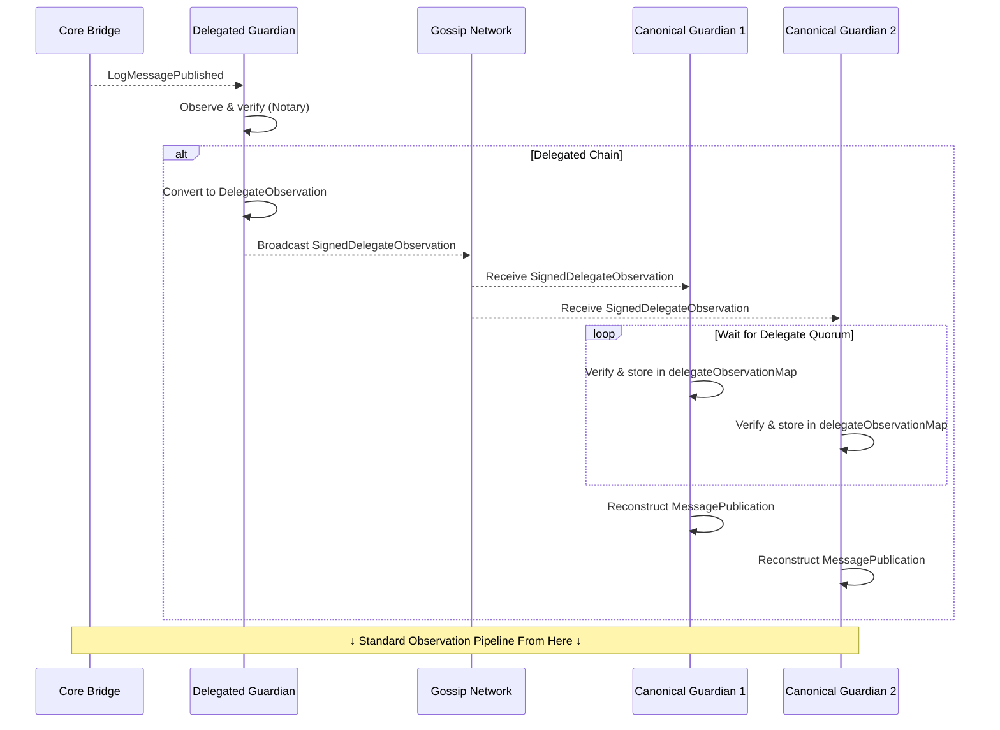

# Delegated Guardian Sets

## Objective

Introduce delegated guardian sets that allow a configurable subset of Guardians to observe and attest to events on specific chains on behalf of the full Guardian Set.

## Background

The Wormhole protocol relies on a set of 19 Guardian nodes to observe on-chain events across all connected chains and attest to them via Verifiable Action Approvals (VAAs). In the current architecture, every Guardian node is expected to maintain full-node infrastructure for each connected chain, placing a symmetric operational burden on every Guardian regardless of chain-specific requirements.

This proposal introduces delegated guardian sets, where a configurable subset of Guardians is designated to observe events on specific chains. The remaining Guardians (referred to as Canonical Guardians for that chain) rely on attested observations gossiped by Delegated Guardians to participate in VAA signing.

Readers should be familiar with the core Wormhole message passing protocol and the Guardian observation pipeline.

## Goals

- Allow a configurable subset of Guardians to be designated as the delegated guardian set for a given chain.
- Define a per-chain delegate threshold that Canonical Guardians use to determine when delegate observations are sufficient to proceed with VAA signing.
- Introduce a new gossip message type for Delegated Guardians to broadcast their observations to Canonical Guardians without changing the VAA format or the final signing mechanism.
- Allow Canonical Guardians to participate in VAA signing for delegated chains without running a local watcher, by reconstructing the necessary message data from delegate observations.
- Ensure that the final VAA is signed by the full Guardian Set (Delegated + Canonical) using the existing supermajority requirement, preserving backward compatibility with all downstream consumers.

## Non-Goals

- Synchronizing delegate observation state across Guardian nodes — each node maintains its own local state.
- Defining Guardian Set membership criteria or governance processes.
- Providing automatic resolution of messages that are delayed by the Notary, Governor, or Accountant systems.

## Overview

Delegated guardian sets introduce an asymmetry in chain observation responsibilities within the Guardian network. For a given chain, a subset of Guardians is designated as Delegated. They run watchers and gossip their observations via a new `DelegateObservation` gossip message to a dedicated p2p topic, signed with their Guardian key to ensure authenticity. The remaining Canonical Guardians subscribe to this topic.

Once a sufficient number of `DelegateObservation` messages agree on a message, Canonical Guardians reconstruct the corresponding `MessagePublication` and proceed through the standard VAA signing pipeline.

The `WormholeDelegatedGuardians` EVM smart contract stores the delegated guardian configuration per chain. Each Guardian node polls this contract every 15 seconds and caches the configuration locally as a `DelegatedGuardianChainConfig`.

## Detailed Design

### Terminology

- **Delegated Chain**: A chain for which a `DelegatedGuardianSet` is configured in the `WormholeDelegatedGuardians` contract. A chain with no such configuration is an undelegated chain.
- **Delegated Guardian**: A Guardian that is a member of the `DelegatedGuardianSet` for a given chain.
- **Canonical Guardian**: A Guardian that is _not_ a member of the `DelegatedGuardianSet` for a given chain.
- **Delegate Quorum**: The state reached when the number of valid `DelegateObservation` messages for a given message meets or exceeds the delegate threshold.

These roles are scoped: a Guardian may be Delegated for one chain and Canonical for another.

### Message Flow Overview

The message flow for undelegated chains is unchanged. The following sequence diagram illustrates the updated flow for delegated chains:



### On-Chain Configuration: `WormholeDelegatedGuardians`

The `WormholeDelegatedGuardians` contract is an immutable EVM contract deployed on a single chain. It stores a mapping of `chainId → DelegatedGuardianSet[]`, where each `DelegatedGuardianSet` contains the chain ID, a timestamp, a threshold value, and the list of Guardian addresses for that configuration. The contract maintains a full history of configurations per chain, enabling auditability.

Configuration updates are submitted via a governance VAA using the `submitConfig` function. The governance payload adheres to the Wormhole governance packet standard (see [Governance Messaging whitepaper](0002_governance_messaging.md)), using the module identifier `DelegatedGuardians` and action `1` (`SET_CONFIG_ACTION`). A single governance VAA can configure multiple chains simultaneously, subject to gas limits. Each update must carry the correct `nextConfigIndex` to prevent out-of-order application and ensure configurations can be correctly reconstructed from on-chain data.

The contract enforces that `threshold` and `keys` are either both zero/empty (effectively removing delegation for a chain) or both non-zero/non-empty. This prevents invalid partial configurations.

The `delegated-guardians-config` `guardiand` admin command provides an operator interface to construct and submit the governance VAA for configuration updates.

Each Guardian node polls `getConfig()` every 15 seconds and stores the result locally as `DelegatedGuardianChainConfig`. This local cache is the source of truth for all delegation decisions within the node.

### API / Message Schema

The following protobuf definitions describe the new gossip message types introduced by this design:

```protobuf
message SignedDelegateObservation {
  // Serialized DelegateObservation message.
  bytes delegate_observation = 1;
  // ECDSA signature using the node's Guardian key.
  bytes signature = 2;
  // Guardian pubkey as truncated eth address.
  bytes guardian_addr = 3;
}

// DelegateObservation contains all the fields necessary for a Canonical Guardian to reconstruct the VAA body.
message DelegateObservation {
  // Seconds since UNIX epoch when this observation was created.
  uint32 timestamp = 1;
  // The nonce for the transfer.
  uint32 nonce = 2;
  // The source chain from which this observation was created.
  uint32 emitter_chain = 3;
  // The address on the source chain that emitted this message.
  bytes emitter_address = 4;
  // The sequence number of this observation.
  uint64 sequence = 5;
  // The consistency level requested by the emitter.
  uint32 consistency_level = 6;
  // The serialized payload.
  bytes payload = 7;
  // Transaction hash on the emitter chain in which the transfer was performed.
  bytes tx_hash = 8;
  // Indicates if this message can be reobserved.
  bool unreliable = 9;
  // Indicates if this message is a reobservation.
  bool is_reobservation = 10;
  // Result of applying transfer verification to the transaction.
  uint32 verification_state = 11;
  // Guardian pubkey as truncated eth address.
  bytes guardian_addr = 12;
  // Seconds since UNIX epoch when this delegate observation was sent.
  int64 sent_timestamp = 13;
}
```

### New Gossip Message Types

Two new message types are introduced:

- **`DelegateObservation`**: Carries the observation data derived from an existing `MessagePublication`, produced by a Delegated Guardian for a delegated chain. It contains all fields necessary for a Canonical Guardian to reconstruct the VAA body.
- **`SignedDelegateObservation`**: The signed p2p wrapper around a `DelegateObservation`. The signing Guardian prepends the `signedDelegateObservationPrefix` before signing with their existing Guardian key, ensuring domain separation (consistent with the prefix scheme described in the [Guardian Signer whitepaper](0009_guardian_signer.md)).

These messages are published to and consumed from a dedicated `delegatedAttestationPubsubTopic`, keeping delegate observation traffic separated from the standard observation gossip.

### Message Flow: Delegated Guardian

1. The Guardian runs a watcher for the delegated chain and observes an on-chain event. The processor receives a `MessagePublication` via `msgC`.
2. The Guardian runs the message through the Notary. If approved, processing continues.
3. The Guardian converts the `MessagePublication` into a `DelegateObservation`, populates any missing fields, marshals it, and sends it to the `gossipDelegatedAttestationSendC` channel. In the p2p layer, the Guardian prepends the `signedDelegateObservationPrefix`, signs the payload, wraps it in a `SignedDelegateObservation`, and publishes it to the `delegatedAttestationPubsubTopic`.
4. The Guardian then proceeds through the remainder of the standard observation pipeline: the message is evaluated by the Governor and/or Accountant modules, after which the Guardian publishes its standard observation and participates in VAA signature aggregation.
5. The Guardian ignores any incoming `SignedDelegateObservation` messages for this chain.

### Message Flow: Canonical Guardian

1. The Guardian ignores any `MessagePublication` from its local watcher for this chain, if one exists. This applies during transition periods where a Guardian may still be running a watcher prior to or during migration to a delegated configuration.
2. The Guardian receives `SignedDelegateObservation` messages via the `delegatedAttestationSubscription`. For each message, the Guardian verifies the prefix, signature, and timestamp, then sends it to the `delegateObsvC` channel.
3. In the processor, the Guardian unmarshals the `DelegateObservation` from its signed wrapper and verifies that the sender is a Delegated Guardian for the message's `EmitterChain`.
4. The Guardian stores the verified `DelegateObservation` in a local `delegateObservationMap`, keyed per Delegated Guardian.
5. If delegate quorum is reached for this message, the Guardian reconstructs the corresponding `MessagePublication` and runs it through the standard message processing loop.
6. If approved, the Canonical Guardian publishes its observation, which participates in the normal VAA signature aggregation process.

### Delegate Threshold

The delegate threshold is stored per chain in the `WormholeDelegatedGuardians` contract and cached locally in the Guardian node's `DelegatedGuardianChainConfig`.

The effective threshold applied by the Guardian node is:

```
effective_threshold = max(onchain_threshold, ⌈2/3 * delegated_set_size⌉)
```

The on-chain configured value is used, but the Guardian node enforces a floor of a supermajority of the delegated guardian set and rejects configurations whose threshold falls below this value.

Replay protection for delegate observations is based on the hash of the serialized `DelegateObservation`, consistent with how `MessagePublication` replay protection works in the standard observation pipeline.

On the Guardian node, the active delegated guardian set for a chain is identified by the timestamp of the latest `DelegatedGuardianSet` entry returned by `getConfig()`. The `nextConfigIndex` from the contract is used for ordering governance submissions but is not tracked per-chain on the node side.

### VAA Compatibility

This design is strictly a Guardian-side protocol extension. The VAA format, version, and signing scheme are entirely unchanged. No new VAA fields or versions are introduced. Downstream consumers of VAAs require no changes.

### CLI and Configuration

The `ethDelegatedGuardiansContract` CLI flag enables a Guardian node to activate delegated guardian support and specify the address of the `WormholeDelegatedGuardians` contract. When this flag is set, the node begins polling the contract and applying delegation logic. When not set, the node behaves identically to the pre-delegation implementation.

## Operational Considerations

### Configuration Propagation

Guardian nodes periodically refresh delegated guardian configuration. During the brief propagation window after an update, different Guardians may temporarily operate with slightly different configurations. Operators should account for this when scheduling configuration updates.

### Watcher Migration

When transitioning a chain from undelegated to delegated operation, Guardians may still be running watchers for that chain. Canonical Guardians ignore local observations to prevent conflicts with the delegate threshold mechanism.

### Failure Mode

If configuration cannot be retrieved from the contract, the Guardian treats the chain as undelegated, allowing observation to continue through the standard mechanism.

### Delayed Messages and Reobservations

Delayed messages and reobservations follow the same delegated flow. Cumulative delays from the Notary (up to 4 days), Governor (up to 24 hours), and Accountant (indefinite) can still apply after delegate quorum is reached by Canonical Guardians.

## Alternatives Considered

### Separate Guardian Network per Chain

One alternative was to deploy a new core bridge contract on selected chains and operate an entirely separate Guardian network with its own keys, gossip network, and bootstrap nodes to observe those chains. This was rejected because it would fragment the trust model and integrators would need to verify VAAs against a different Guardian Set depending on the emitting chain, requiring changes to all downstream consumers.

### Reduced Verification Threshold at the Integrator Layer

Another alternative was to keep the existing core bridge contracts unchanged and require integrators to implement custom attestation logic that accepts a lower number of Guardian signatures for messages from specific chains. This was rejected because it requires changes across all integrators (NTT, GMP integrators) and has no clear support path for token bridge transfers, which have no mechanism for per-chain threshold configuration.

### Shared RPC Infrastructure

A third alternative was to maintain the full Guardian Set for all chains but reduce infrastructure costs by having a subset of Guardians share a small number of RPC endpoints for lower-priority chains. This was rejected because it introduces additional trust assumptions. For instance, a coordinated RPC provider and a small number of Guardians would be sufficient to produce a fraudulent observation, reducing the effective security threshold below the intended level.

### Separate Guardian Sets per Chain with Contract Upgrades

A final alternative was to upgrade all core bridge contracts to support multiple Guardian Sets, selecting the appropriate set for verification based on the emitting chain. This was rejected due to the significant scope of contract upgrades required across all connected chains and the complexity introduced into the VAA verification path for all integrators.

By introducing an intermediate gossip protocol instead, the current design preserves the existing Guardian quorum and VAA verification model while allowing observation responsibilities to be distributed.

## Security Considerations

### VAA Authority

Both Delegated and Canonical Guardians sign the final VAA using their existing Guardian keys. The resulting VAA contains signatures from all participating Guardians and continues to require a supermajority of the full Guardian Set to be considered valid. Delegate observations are strictly an intermediate step within the Guardian network and have no bearing on the external VAA verification model.

### Trust Model

The delegate observation mechanism introduces a new trust boundary: Canonical Guardians trust that Delegated Guardians are faithfully reporting on-chain events. This trust is bounded in two ways. First, Canonical Guardians verify delegate observations against the delegated guardian configuration stored in the `WormholeDelegatedGuardians` contract. Second, a configurable delegate threshold of Delegated Guardians must agree on an observation before Canonical Guardians act on it, preventing a single Delegated Guardian from unilaterally influencing Canonical Guardian behavior.

A critical property of this design is that Canonical Guardians must wait for delegate quorum before publishing their own observations. Consider a delegated guardian set of N Guardians with a delegate threshold of ⌈2/3 × N⌉: if Canonical Guardians were to sign and broadcast observations without first waiting for delegate quorum, a small number of colluding Delegated Guardians could produce fraudulent observations that Canonical Guardians would then co-sign, resulting in a valid 13/19 VAA whose effective security is far below the intended delegate threshold. By requiring delegate quorum first, the security of the final VAA is bounded by the delegate threshold rather than the number of colluding Delegated Guardians.

The final VAA still requires a supermajority of the full Guardian Set (Delegated + Canonical), preserving the end-to-end security guarantees of the protocol.

### Transfer Verifier

Delegated Guardians run the Notary (Transfer Verifier) on observed messages before broadcasting a `DelegateObservation`. If the Notary rejects a message, the `DelegateObservation` is never published, and Canonical Guardians will not receive it.

### Governor and Accountant

Both Delegated and Canonical Guardians run the Governor and Accountant independently, ensuring that rate limits and accountant quorum are unaffected by delegation.

After the Notary approves a message, Delegated Guardians publish the `DelegateObservation` and then pass the message through the Governor and Accountant as part of the standard message processing loop.

After delegate quorum is reached, Canonical Guardians reconstruct a `MessagePublication` from one of the agreeing `DelegateObservation` messages and pass it through the standard message processing loop, including the Notary, Governor, and Accountant. Governor rate limits and Accountant checks may therefore delay or block messages on either side.

### Governance Security

Configuration updates to the `WormholeDelegatedGuardians` contract require a valid governance VAA signed by the current Guardian Set. The contract enforces replay protection via `governanceActionsConsumed` and ordered submission via sequential `nextConfigIndex`, ensuring configuration updates are applied in the correct order.

### Configuration Validation

The `WormholeDelegatedGuardians` contract performs limited on-chain validation of submitted configurations. Correctness of guardian addresses, threshold values, and other config parameters is enforced off-chain via the `delegated-guardians-config` `guardiand` admin command, Guardian node checks, and the governance VAA process.

### Canonical Guardian Isolation

Canonical Guardians actively discard their own local watcher observations for delegated chains. This prevents a scenario where a Canonical Guardian's stale or inconsistent watcher state could interfere with the delegate threshold calculation or produce a conflicting VAA signature path.

### Denial of Service

If a sufficient number of Delegated Guardians go offline or are compromised, Canonical Guardians will not reach delegate quorum and VAAs for that chain will not be produced. This is analogous to the existing risk of Guardian downtime on undelegated chains. Operators should monitor Delegated Guardian availability and configure thresholds conservatively.
